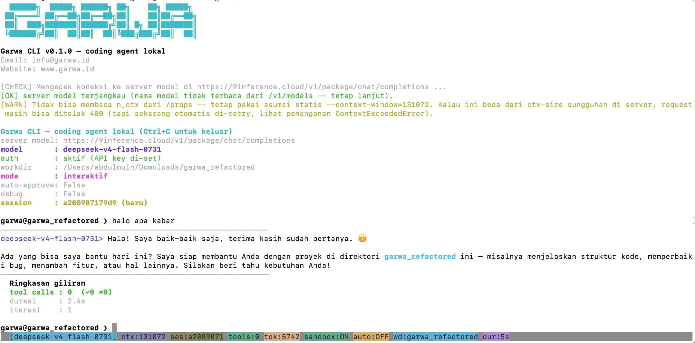

# Garwa — CLI Coding Agent Lokal

**Garwa** adalah CLI coding agent lokal yang bekerja dengan server model
*OpenAI-compatible* (mis. server model berbasis llama.cpp / vLLM, atau
endpoint `/v1/chat/completions` apa pun). Garwa membaca & menulis file di
mesin Anda, menjalankan perintah shell, mencari di GitHub, mencari berita,
menjalankan audit keamanan, dan banyak lagi — semuanya lewat percakapan
natural atau mode otomatis (auto / overnight) tanpa pengawasan.

> Versi saat ini: **0.5.1**



---

## Daftar Isi

1. [Fitur Utama](#fitur-utama)
2. [Persyaratan](#persyaratan)
3. [Instalasi](#instalasi)
   - [Instalasi cepat (install.sh)](#instalasi-cepat-installsh)
   - [Instalasi manual](#instalasi-manual)
   - [Uninstall](#uninstall)
4. [Cara Pakai](#cara-pakai)
5. [Mode Interaktif](#mode-interaktif)
6. [Mode Auto](#mode-auto)
7. [Mode Overnight](#mode-overnight)
8. [Mode Telegram Gateway](#mode-telegram-gateway)
9. [Tool yang Tersedia](#tool-yang-tersedia)
10. [Skills](#skills)
11. [Penyimpanan Sesi & Memori](#penyimpanan-sesi--memori)
12. [Konfigurasi (Environment Variable)](#konfigurasi-environment-variable)
13. [Struktur Proyek](#struktur-proyek)
14. [Pengembangan & Testing](#pengembangan--testing)
15. [Keamanan & Sandbox](#keamanan--sandbox)
16. [Dibuat oleh AI](#dibuat-oleh-ai)
17. [FAQ](#faq)

---

## Fitur Utama

- **Coding agent interaktif** — percakapan natural untuk membaca/menulis
  file, menjalankan bash, commit git, dan lain-lain.
- **20+ tool bawaan** terintegrasi (file, bash, web, GitHub, keamanan,
  session, dll.) — lihat tabel lengkap di [Tool yang Tersedia](#tool-yang-tersedia).
- **Sandbox path** — secara default tool file/bash hanya boleh mengakses
  path di dalam `--workdir`. Bisa dinonaktifkan dengan `--no-sandbox`.
- **Mode auto** — jalankan satu task non-interaktif lalu keluar.
- **Mode overnight** — jalankan banyak task berurutan tanpa pengawasan,
  lengkap dengan file log dan opsi checklist markdown.
- **Sesi persisten** — riwayat percakapan, plan/todo, dan catatan proyek
  disimpan dalam database SQLite; bisa dilanjutkan kapan saja dengan `--resume`.
- **Skills** — folder berisi paket skill (markdown) yang otomatis dimuat
  sebagai system prompt. Beberapa skill siap pakai sudah disertakan.
- **Vision input** — drop gambar (atau tempel path gambar) untuk dikirim
  sebagai input visual ke model.
- **Manajemen konteks** — estimasi token, deteksi batas context window,
  retry otomatis saat request ditolak karena melampaui konteks. Parameter
  context-window & summarization dapat dikonfigurasi via flag CLI, env
  variable, atau slash-command (lihat [Konfigurasi](#konfigurasi-environment-variable)).
- **Ringkasan konteks cerdas** — saat konteks mendekati batas, pesan lama
  diringkas secara otomatis; **instruksi aktif** dari ringkasan disimpan dan
  disuntikkan kembali setiap giliran agar konteks tidak hilang. Pesan penting
  bisa di-pin (`/pin`) agar tidak ikut diringkas.
- **Native tool-calling** — skema tool dikirim lewat field `tools` ala
  OpenAI di tiap request, dengan fallback ke skema teks penuh.
- **Integrasi MCP (Model Context Protocol)** — Garwa bertindak sebagai **MCP
  client** yang mengonsumsi tool dari MCP server eksternal (stdio /
  streamable HTTP). Tool eksternal didaftarkan dengan prefix
  `mcp.<server>.<tool>` dan dipakai seperti tool bawaan. Kelola lewat
  slash-command `/mcp-server`, `/mcp-api-key`, `/mcp-enable` atau file
  `~/.config/garwa/mcp.json`.
- **Integrasi Firecrawl** — tool `firecrawl_scrape`, `firecrawl_search`, dan
  `firecrawl_crawl` untuk mengambil & mencari konten web via Firecrawl
  (butuh API key; atur lewat `/firecrawl-key` atau env `FIRECRAWL_API_KEY`).
- **Deteksi loop & repetisi** — deteksi loop antar-respon (tool_call
  berulang), repetisi teks, dan error-loop (JSON tidak valid berulang)
  dengan intervensi otomatis agar agent tidak terjebak loop tak berujung.
- **Standardisasi skema tool (JSON-Schema)** — `inputSchema` berformat
  JSON-Schema penuh sebagai sumber kebenaran kanonik, interoperabel dengan
  MCP & OpenAI function-calling.

---

## Persyaratan

- **Python 3.10+**
- **Server model OpenAI-compatible** yang aktif dan terjangkau (default:
  `https://coder.garwa.id/v1/chat/completions`, bisa diganti dengan `--url`
  atau env `LLAMA_URL`).
- Koneksi internet untuk tool web/GitHub (opsional untuk fitur lokal).

Dependensi Python (lihat `requirements.txt`):

| Paket | Wajib? | Fungsi |
|-------|--------|--------|
| `requests>=2.31` | ✅ Wajib | HTTP client ke server model & API |
| `beautifulsoup4>=4.12` | ⭕ Opsional | Parsing HTML lebih akurat di `webfetch` (ada fallback regex) |
| `tiktoken>=0.7` | ✅ Wajib | Penghitungan penggunaan token yang akurat (estimasi berbasis BPE, bukan perkiraan char) |
| `tree-sitter>=0.21` + grammar (lihat di bawah) | ✅ Wajib | Outline simbol AST + tool `check`/`snippet` (poor-man's LSP) di `repo_map` (ada fallback regex bila grammar bahasa belum terpasang) |

> **Grammar tree-sitter (untuk AST multi-bahasa):** Garwa memakai
> loader berjenjang: `tree-sitter-language-pack` bila tersedia, lalu grammar
> individual per-bahasa (`tree-sitter-python`, `tree-sitter-javascript`, dll),
> lalu `tree_sitter_languages`, lalu regex.
>
> ⚠️ **Catatan arsitektur penting (Termux/Android):** `tree-sitter-language-pack`
> (mis. 1.16.2) *panic* di Termux/Android — `get_parser()` memicu panic Rust
> (`rustls-platform-verifier`) yang muncul sebagai `pyo3 PanicException`
> (subclass `BaseException`). Karena itu, di perangkat tersebut grammar
> individual yang di-build dari source (non-abi3, tanpa hide-symbols) adalah
> **jalur andal utama**, bukan sekadar fallback. Semua pemanggilan tree-sitter
> menangkap `BaseException` (bukan hanya `Exception`) sehingga panic tidak
> pernah membuat Garwa crash — cukup fallback ke regex. Bangun grammar dengan:
> `bash scripts/build_ts_grammars.sh`. Tool `check` (compiler error locator)
> dan `snippet` (konteks AST posisi) aktif otomatis untuk file dengan grammar
> terpasang.

> `tiktoken` dan `tree-sitter` adalah **wajib** — keduanya inti dari akurasi
> penghitungan token dan kemampuan AST (poor-man's LSP). Dependensi opsional
> lain (mis. `beautifulsoup4`) punya fallback otomatis jika tidak terinstall,
> jadi Garwa tetap berjalan tanpa paket tersebut.

---

## Instalasi

### Instalasi cepat (install.sh)

Skrip `install.sh` membuat virtualenv terisolasi di `garwa/.venv`,
menginstall `requirements.txt`, dan memasang launcher `garwa` di
`~/.local/bin` sehingga perintah `garwa` bisa dipanggil dari **folder mana
pun** (workdir otomatis = folder tempat Anda memanggilnya).

```bash
./install.sh                 # instal dengan pengaturan default
./install.sh --prefix DIR    # pasang launcher ke DIR (default ~/.local/bin)
./install.sh --no-venv       # pakai Python sistem, tanpa virtualenv
./install.sh --help          # lihat semua opsi
```

Installer kini **otomatis menambahkan folder launcher ke `PATH`** secara
persisten (mendeteksi shell profile aktif — `.zshrc`, `.bash_profile`/`.bashrc`,
fallback `.profile`). Setelah instalasi, buka terminal baru (agar perubahan
PATH berlaku) lalu:

```bash
garwa --help
```

Jika Anda menginstal manual tanpa `install.sh`, pastikan folder launcher ada
di `PATH`:

```bash
export PATH="$HOME/.local/bin:$PATH"   # tambahkan ke ~/.bashrc / ~/.zshrc
```

> **Catatan:** launcher dibuat agar workdir otomatis mengikuti folder tempat
> Anda memanggil `garwa`, dan folder `skills/` tetap ditemukan dari repo ini
> (dihitung dari path absolut paket), jadi skill Anda selalu tersedia dari
> folder mana pun.

### Instalasi manual

Tanpa `install.sh`, cukup jalankan langsung dari repo:

```bash
pip install -r requirements.txt
python garwa_cli.py --help
# atau
python -m garwa --help
```

### Uninstall

`uninstall.sh` menghapus launcher `garwa` (dan opsional virtualenv).

```bash
./uninstall.sh                 # hapus launcher saja (venv dibiarkan)
./uninstall.sh --purge         # hapus launcher + folder .venv
./uninstall.sh --prefix DIR    # hapus launcher dari folder selain default
./uninstall.sh -y              # tanpa konfirmasi (untuk skrip otomatis)
./uninstall.sh --help          # lihat semua opsi
```

> Uninstall **tidak** menghapus database sesi (`*.db`) atau folder `skills/`,
> jadi riwayat sesi Anda tetap aman.

### Instalasi Windows (install.ps1)

Di Windows, gunakan `install.ps1` (PowerShell). Skrip ini membuat virtualenv
terisolasi di `garwa\.venv`, menginstall `requirements.txt`, memasang launcher
`garwa.cmd` + `garwa.ps1` di `%USERPROFILE%\.local\bin` (default), dan otomatis
menambahkan folder launcher ke `PATH` user.

Dari root repo, jalankan di PowerShell:

```powershell
# 1. Izinkan skrip lokal ditandatangani (cukup sekali per user):
Set-ExecutionPolicy RemoteSigned -Scope CurrentUser

# 2. Hapus tanda "blocked" pada file hasil unduhan (zip/clone dari browser),
#    kalau PowerShell masih menolak menjalankan skrip:
Unblock-File .\install.ps1

# 3. Jalankan installer:
.\install.ps1                 # instal dengan pengaturan default
.\install.ps1 -Prefix DIR     # pasang launcher ke DIR (default ~\.local\bin)
.\install.ps1 -NoVenv         # pakai Python sistem, tanpa virtualenv
.\install.ps1 -Python py -3.12   # pakai interpreter Python tertentu
.\install.ps1 -Help           # lihat semua opsi
```

Setelah selesai, **buka terminal baru** (agar perubahan PATH berlaku) lalu:

```powershell
garwa --help
```

Uninstall menggunakan `uninstall.ps1`:

```powershell
.\uninstall.ps1                 # hapus launcher saja (venv dibiarkan)
.\uninstall.ps1 -Purge          # hapus launcher + folder .venv
.\uninstall.ps1 -Prefix DIR     # hapus launcher dari folder selain default
.\uninstall.ps1 -RemoveFromPath # sekalian hapus folder launcher dari PATH user
.\uninstall.ps1 -Yes            # tanpa konfirmasi
```

> Sama seperti versi Unix, uninstall **tidak** menghapus database sesi
> (`*.db`) atau folder `skills/`.

---

## Cara Pakai

Sebelum menjalankan `garwa`, pastikan Anda sudah melakukan konfigurasi
environment variables berikut:

```bash
# Wajib — kredensial server model
export LLAMA_API_KEY="sk-..."
export LLAMA_URL="http://localhost:8080/v1/chat/completions"
```

Opsional, hanya jika ingin integrasi dengan GitHub atau menggunakan Firecrawl:

```bash
export GITHUB_TOKEN="github_pat_..."
export FIRECRAWL_API_KEY="fc-..."
```

Setelah itu jalankan `garwa` (atau `python garwa_cli.py`) dari folder kerja
Anda:

```bash
garwa --model deepseek-v4-pro
```

Jika tidak menyebutkan `--model`, Garwa memakai model dari config
(`~/.config/garwa/config`, disimpan via `/api-model`), lalu env `LLAMA_MODEL`,
lalu default bawaan (`deepseek-v4-flash-0731`).

Garwa akan mengecek koneksi ke server model, menampilkan banner, lalu
memberikan prompt interaktif `You>`. Ketik permintaan dalam bahasa natural,
misalnya:

```
You> buatkan file README.md untuk proyek ini
You> jalankan git status lalu commit semua perubahan
You> cari bug di folder src/ dan perbaiki
You> buat laporan dari file sales.csv
```

Ketik `/exit` atau `/quit` untuk keluar, atau tekan `Ctrl+C` untuk kembali
ke prompt (dan sekali lagi untuk keluar).

### Opsi baris perintah lengkap

```
garwa [opsi]

  --url URL               Endpoint chat completions server model
                          (default: env LLAMA_URL)
  --api-key KEY           API key server model (header Authorization: Bearer)
  --model NAME            Nama model (default: config.LLAMA_MODEL /
                          env LLAMA_MODEL / deepseek-v4-flash-0731)
  --temperature FLOAT     Sampling temperature, default 0.6
                          (DeepSeek-R1 disarankan 0.5–0.7)
  --skills-dir DIR        Folder berisi paket skills (default: <repo>/skills)
  --workdir DIR           Working directory untuk tool file/bash
                          (default: folder saat dipanggil)
  --no-sandbox            Izinkan tool file/bash akses path di luar --workdir
  --auto-approve          Lewati konfirmasi aksi destruktif
  --max-tool-iters N      Batas pemanggilan tool per giliran (default: 100)
  --max-image-mb FLOAT    Batas ukuran gambar vision (MB, default: 8)
  --context-window N      Ukuran context window server (token, default: 131072)
  --reserve-for-response N  Token cadangan untuk respons (default: 2048)
  --summarize-threshold-ratio F  Rasio ambang ringkasan 0.0-1.0 (default: 0.2)
  --keep-tail-messages N   Jumlah pesan akhir yang dipertahankan saat ringkas (default: 8)
  --no-stream             Pakai response JSON biasa, bukan SSE streaming
  --full-tool-schema-text Tulis skema tool LENGKAP sebagai teks di system prompt
  --skip-server-check     Lewati pengecekan koneksi server saat startup
  --debug                 Cetak request & seluruh respon mentah ke STDERR
  --db-path PATH          Path file SQLite sesi (default: <workdir>/.garwa.db)
  --resume [SESSION_ID]   Lanjutkan sesi (tanpa nilai = sesi terbuka terakhir)
  --list-sessions         Tampilkan daftar sesi tersimpan lalu keluar
  --session-title TITLE   Judul opsional untuk sesi baru
  --auto                  Mode auto: satu task non-interaktif lalu keluar
  --overnight             Mode overnight: banyak task berurutan tanpa pengawasan
  --task "TEXT"           Instruksi task untuk --auto / task pertama --overnight
  --tasks-file PATH       File daftar task (satu per baris, atau blok '---')
  --overnight-log PATH    Path file log overnight (default: <workdir>/.garwa_overnight/)
  --stop-on-error         Hentikan antrean begitu satu task gagal
  --plan-file FILE        Checklist markdown ('- [ ]' / '- [x]') untuk overnight
  --repeat-until-done     Ulangi task terakhir sampai checklist selesai
  --max-repeats N         Batas pengulangan --repeat-until-done (default: 50)
  --mcp-config FILE       Path file konfigurasi MCP (format mirip mcpServers
                          Claude Desktop). Default: ~/.config/garwa/mcp.json.
                          Tool dari server MCP didaftarkan dengan prefix
                          'mcp.<server>.<tool>'.
  --bot                   Mode gateway Telegram: jalankan agent Garwa dari chat
                          Telegram (polling sekali lalu keluar). Otomatis
                          mengaktifkan --auto-approve.
  --forever               Mode --bot: polling getUpdates terus-menerus.
```

---

## Mode Interaktif

Ini mode default. Garwa menampilkan prompt `You>` dan memproses setiap
pesan Anda dalam satu "giliran" (loop agent): model memutuskan tool mana
yang dipakai, tool dijalankan, hasilnya dikembalikan ke model, dan begitu
seterusnya sampai jawaban final.

Beberapa perilaku khusus di input:

- **Drop / tempel path file** — menempelkan path file akan otomatis
  melampirkan file tersebut sebagai input (termasuk gambar sebagai vision).
- **Tempel teks multi-baris** — teks yang mengandung baris baru dianggap
  sebagai paste/attachment, bukan perintah shell.
- **Slash command** — `/exit`, `/quit` untuk keluar, `/help` untuk daftar
  lengkap. Beberapa command menerima argumen, mis. `/api-model deepseek-v4-flash-0731`,
  `/news-lang en`, `/github-token <token>`, `/github-max <angka>`, dan
  `/firecrawl-key <token>` (API key Firecrawl, disimpan lintas sesi di
  `~/.config/garwa/config`).
- **Persistensi model & endpoint** — `/api-model <nama>` mengganti model aktif,
  `/api-url <url>` mengganti endpoint server, dan `/api-key <kunci>` mengganti
  API key — semuanya disimpan lintas sesi di `~/.config/garwa/config`.
  Prioritas tiap nilai: env (`LLAMA_MODEL` / `LLAMA_URL` / `LLAMA_API_KEY`) >
  config > default bawaan. `/api-key` tanpa argumen **menghapus** key dari config.
- **Slash command manajemen konteks** — atur parameter context-window dan
  summarization secara runtime, tersimpan lintas sesi:
  - `/ctx <angka>` — ubah ukuran context window (token).
  - `/reserve <angka>` — token cadangan untuk respons.
  - `/summarize-threshold <rasio>` — rasio ambang ringkasan (0.0–1.0).
  - `/keep-tail <angka>` — jumlah pesan akhir yang dipertahankan saat ringkas.
- **Slash command pin pesan** — kunci pesan penting agar tidak ikut diringkas:
  - `/messages` — tampilkan daftar pesan beserta ID-nya.
  - `/pin <id> [<id> ...]` — pin pesan; `/unpin <id> [...]` — lepas pin;
    `/pinned` — lihat pesan yang sedang di-pin.
- **Slash command lain** — `/new` (sesi baru), `/resume`, `/clear`, `/todos`,
  `/tools`, `/approve` (toggle auto-approve).
- **Slash command MCP** — kelola server MCP langsung dari prompt:
  - `/mcp-server list` — tampilkan server yang terdaftar.
  - `/mcp-server add <nama> <cmd> [args...]` — daftarkan server stdio.
  - `/mcp-server add <nama> http <url>` — daftarkan server streamable HTTP.
  - `/mcp-server remove <nama>` — hapus server.
  - `/mcp-api-key <nama> <key>` — set header Authorization untuk server HTTP.
  - `/mcp-enable <nama> [on|off]` — aktifkan/nonaktifkan koneksi server.

---

## Mode Auto

Jalankan satu task secara non-interaktif lalu keluar. Otomatis mengaktifkan
`--auto-approve` (tidak ada manusia untuk konfirmasi).

```bash
garwa --auto --task "perbaiki semua file yang gagal lint lalu commit"
# atau dari file task
garwa --auto --tasks-file tasks.txt
```

- `--task` berisi instruksi task tunggal.
- `--tasks-file` berisi daftar task; mode `--auto` hanya menjalankan **task
  pertama** (gunakan `--overnight` untuk semuanya).
- Mode auto **butuh server model aktif sejak awal** (kecuali dengan
  `--skip-server-check`).

---

## Mode Overnight

Jalankan **banyak task berurutan tanpa pengawasan**, tiap task di sesi baru,
lanjut ke task berikutnya walau ada error (kecuali `--stop-on-error`).
Seluruh transkrip dicatat ke file log. Otomatis mengaktifkan `--auto-approve`.

```bash
garwa --overnight --task "task pertama" --tasks-file tasks.txt
```

### Format `--tasks-file`

Default: satu task per baris non-kosong (baris berawalan `#` diabaikan).

```
Perbaiki bug di src/parser.py
Tulis test untuk parser
Update dokumentasi
```

Jika file mengandung baris pemisah `---` (3+ dash), file diperlakukan
sebagai **blok multi-baris** — tiap blok antar pemisah menjadi satu task
(berguna untuk instruksi panjang / multi-paragraf):

```
Refactor fungsi parse() agar mendukung JSON.
Tambahkan error handling untuk input kosong.
---
Buat file CHANGELOG.md berisi ringkasan perubahan terbaru.
```

### Checklist markdown (`--plan-file`)

Untuk task berkelanjutan, beri file checklist markdown (relatif ke
`--workdir`, mis. `tasks.md`) berisi baris `- [ ] task` / `- [x] task`.
Tiap giliran overnight diberi instruksi membaca & memperbarui file ini —
checklist menjadi **satu-satunya memori bersama antar sesi**.

```bash
garwa --overnight --plan-file tasks.md --repeat-until-done
```

- `--repeat-until-done`: setelah antrean selesai, terus ulangi task TERAKHIR
  di sesi baru selama `--plan-file` masih punya `- [ ]` yang belum tercentang.
- `--max-repeats`: batas jumlah pengulangan (default 50).
- `--stop-on-error`: hentikan seluruh antrean begitu satu task gagal.
- `--overnight-log`: path log (default `<workdir>/.garwa_overnight/overnight_<timestamp>.log`).

---

## Mode Telegram Gateway

Jalankan Garwa dari **chat Telegram** — kirim perintah/pertanyaan, Garwa
menjalankan agent loop (baca/tulis file, bash, git, dll) di mesin lokal, lalu
membalas hasilnya kembali ke chat asal. Ini gateway **dua arah** (bukan hanya
kirim notifikasi satu arah).

```bash
garwa --bot                # polling sekali lalu keluar
garwa --bot --forever      # polling terus-menerus (long-running)
```

Saat `--bot` aktif, `--auto-approve` otomatis diaktifkan (tidak ada manusia
untuk menjawab konfirmasi). Gunakan `--skip-server-check` jika server model
tidak punya endpoint `/v1/models`.

### Setup Telegram

1. Buat bot lewat [@BotFather](https://t.me/BotFather) di Telegram untuk
   mendapat **token bot**.
2. Dapatkan **ID akun admin** Anda (chat_id). Cara mudah: kirim pesan ke bot
   lalu cek via `getUpdates`, atau pakai bot seperti
   [@userinfobot](https://t.me/userinfobot).
3. Set kredensial (env atau `.env`):

```bash
# Token bot dari @BotFather
export TELEGRAM_TOKEN="123456:ABC-DEF..."

# ID akun Telegram yang BOLEH memerintah bot (chat_id)
export TELEGRAM_ADMIN_ID="854200656"

# Opsional: izinkan SEMUA user (hanya untuk development!)
# export GARWA_TELEGRAM_ALLOW_ALL="true"
```

   Garwa juga menerima prefiks `GARWA_TELEGRAM_*` dan `JOB_TELEGRAM_*`
   (kompatibel dengan konfigurasi jobbot yang sudah ada).

4. Jalankan gateway:

```bash
garwa --bot --forever --skip-server-check
```

5. Di Telegram, buka bot Anda (mis. `@garwaidbot`) dan kirim perintah.

### Perintah di chat bot

| Perintah | Fungsi |
|----------|--------|
| `/start` | Mulai / tampilkan bantuan |
| `/help` | Tampilkan bantuan |
| `/new` | Mulai sesi percakapan baru |
| `/status` | Info sesi saat ini (ID, judul, jumlah pesan, workdir) |
| `/todos` | Tampilkan todo list sesi ini |
| `/memory` | Kelola catatan proyek: `/memory list`, `/memory show <key>`, `/memory forget <key>` |
| `/sessions` | Daftar sesi tersimpan untuk workdir ini |
| `/model` | Lihat/ganti model aktif: `/model <nama>` |
| `/undo` | Batalkan giliran terakhir (hapus pesan user + balasan model/tool) |
| `/retry` | Ulangi giliran terakhir (kirim ulang pesan user terakhir ke model) |
| `/search <query>` | Cari pesan lintas sesi (cross-session memory, FTS5) |
| `/personality <deskripsi>` | Set persona lintas sesi (kosongkan untuk hapus) |
| `/usage` | Agregasi pemakaian token lintas sesi (per hari & per tool) |
| `/stop` | Batalkan proses yang sedang berjalan (interrupt agent turn) |
| `/exit` | Tutup sesi bot |

Perintah slash lain (mis. `/git-status`, `/git-log`, `/api-model`, `/clear`,
`/compact`, `/cost`, `/summary`, dll) ditangani oleh handler slash-command CLI
Garwa yang sama dengan mode interaktif — jadi hasilnya konsisten. Hanya
perintah slash yang **tidak dikenal** yang jatuh ke agent sebagai pesan biasa
(mis. `/email`), supaya user tetap bisa bicara bebas dengan model.

### Cara kerja

- **Long polling** `getUpdates` (hanya butuh `requests`, tanpa library
  eksternal).
- **Allowlist admin**: hanya `TELEGRAM_ADMIN_ID` (atau `--allow-all`) yang
  boleh memerintah bot; yang lain ditolak.
- **Sesi per chat**: tiap chat Telegram punya session Garwa sendiri (tabel
  `telegram_bindings` di database Garwa), jadi riwayat per-chat terpisah dan
  bisa di-resume antar sesi bot.
- **Busy-ack**: bot membalas `⏳ Garwa sedang memproses...` sebelum proses,
  lalu hasil `run_agent_loop` menyusul setelah selesai.
- **Agent turn berjalan di thread daemon** sehingga polling tetap memproses
  update lain (termasuk `/stop`) selama sebuah turn sedang berjalan. `/stop`
  menandai interrupt per-sesi yang dicek agent loop di tiap iterasi, jadi
  turn berhenti secepatnya tanpa mematikan proses.
- **Cron delivery**: saat `--bot --forever` aktif, jadwal cron (lihat
  [Mode Cron](#mode-cron-scheduling)) ikut dieksekusi tiap menit, dan hasilnya
  dikirim ke chat admin Telegram (bukan cuma log stdout).
- **Tanpa `parse_mode=HTML`**: hasil agent sering mengandung karakter HTML
  mentah (`<path>`, `<file>`, dll) yang bikin API Telegram 400 kalau
  `parse_mode=HTML` diaktifkan, jadi pesan dikirim sebagai plain text.

---

## Mode Cron (Scheduling)

Garwa punya **scheduler cron berbasis SQLite** (stdlib-only, ringan, robust)
yang bisa menjadwalkan eksekusi `bash`, `send_email`, dan `send_telegram` tanpa
proses/crontab eksternal. Saat gateway `--bot --forever` berjalan, jadwal cron
ikut dieksekusi tiap menit, dan hasilnya dikirim ke chat admin Telegram.

Fitur utama:

- **Validasi ekspresi cron ketat** saat insert (modul `garwa/tools/_cron_expr.py`)
  — menolak field di luar rentang / sintaks salah.
- **Anti-double-run** via claim atomik (kolom `running`/`claimed_at`, stale
  `300s`) supaya task tidak dijalankan dua kali walau ada banyak runner.
- **Catch-up / missed-run**: kalau runner sempat mati beberapa menit, slot menit
  yang terlewat ikut dieksekusi (dibatasi `MAX_CATCHUP_MINUTES=60`).
- **Timeout seragam** semua aksi (bash 120s, email/telegram 60s) via thread.
- **Retry/backoff transien** untuk `send_email`/`send_telegram`
  (`MAX_RETRIES=3`, backoff + jitter); bash tidak di-retry.
- **Audit trail** ke tabel `schedule_runs` (memakai koneksi yang sama untuk
  hindari deadlock SQLite).
- **Guard keamanan** `_DANGEROUS_BASH_RE` untuk aksi `bash` cron (pola berbahaya
  ditolak langsung, bukan di-force).

Tool terkait (dipanggil model): `schedule_task`, `list_schedules`,
`remove_schedule`, `enable_schedule`, `disable_schedule`.

---

## Tool yang Tersedia

Garwa mendaftarkan **23 tool bawaan** yang bisa dipanggil model (plus tool
dinamis dari MCP server eksternal jika diaktifkan). Ringkasan:

| Tool | Deskripsi | Destruktif? |
|------|-----------|-------------|
| `bash` | Jalankan perintah shell di working directory | ⚠️ Dinamis (pola berbahaya meminta konfirmasi) |
| `read_file` | Baca isi file teks dengan nomor baris | Tidak |
| `write_file` | Buat file baru / timpa seluruh isi file | ✅ Ya |
| `edit_file` | Cari string unik lalu ganti (edit presisi) | ✅ Ya |
| `list_dir` | Tampilkan daftar file & folder | Tidak |
| `grep` | Cari pola teks/regex di file-file (rekursif) | Tidak |
| `glob` | Cari file dengan glob pattern | Tidak |
| `repo_map` | Peta struktur repo (file + simbol, ranking PageRank) | Tidak |
| `outline_file` | Daftar simbol top-level suatu file | Tidak |
| `todo_write` | Simpan/timpa plan (daftar todo) sesi | Tidak |
| `todo_read` | Baca plan/todo sesi | Tidak |
| `remember` | Simpan catatan proyek key-value persisten | Tidak |
| `recall` | Baca catatan proyek tersimpan | Tidak |
| `security_scan` | Audit keamanan lokal (SAST/dependency/secrets/IaC/DAST) | Tidak |
| `local_now` | Tanggal & jam saat ini (WIB, UTC+7) | Tidak |
| `web_search` | Cari berita terkini via Google News RSS | Tidak |
| `github_search_repos` | Cari repository publik GitHub | Tidak |
| `github_search_code` | Cari potongan kode di GitHub (butuh token) | Tidak |
| `github_read_file` | Baca file source code dari repo GitHub publik | Tidak |
| `firecrawl_scrape` | Ambil konten satu halaman web jadi markdown (butuh API key Firecrawl) | Tidak |
| `firecrawl_search` | Cari di web via Firecrawl (butuh API key Firecrawl) | Tidak |
| `firecrawl_crawl` | Crawl satu situs via Firecrawl (butuh API key Firecrawl) | Tidak |
| `webfetch` | Fetch konten dari URL (text/markdown/html) | Tidak |

> **Destruktif** = tool yang bisa mengubah/menghapus data. Aksi destruktif
> meminta konfirmasi interaktif, kecuali `--auto-approve` diaktifkan.
> `bash` bersifat dinamis: hanya command yang cocok pola berbahaya
> (mis. `rm -rf`, `dd` ke device, force-push) yang meminta konfirmasi.
>
> **Pengecualian — path di luar sandbox:** aksi tulis ke path di luar
> *working directory* (sandbox) TETAP wajib konfirmasi manual walau
> `--auto-approve` aktif. Di mode non-interaktif (tanpa stdin), aksi
> semacam ini otomatis ditolak — tidak pernah crash.
>
> **⚠️ Implikasi untuk mode `--overnight`:** mode ini berjalan tanpa
> pengawasan dan tanpa stdin, sehingga **semua aksi wajib berada di
> dalam workdir**. Setiap percobaan menulis ke path di luar workdir
> akan otomatis ditolak dan task yang memicunya akan gagal. Pastikan
> prompt/checklist task Anda hanya merujuk path di dalam workdir.

**Tool MCP dinamis** — saat integrasi MCP aktif, tool dari server eksternal
muncul dengan nama `mcp.<server>.<tool>` (mis. `mcp.test-server.add`) dan
bisa dipanggil seperti tool bawaan. Daftarnya bergantung pada server yang
didaftarkan via `/mcp-server` atau `~/.config/garwa/mcp.json`.

---

## Skills

Skills adalah folder berisi paket instruksi markdown yang otomatis dimuat
sebagai ringkasan di system prompt. Letakkan di folder `skills/` sejajar
(sibling) dengan `garwa/` dan `garwa_cli.py`:

```
repo-root/
  garwa/
  garwa_cli.py
  requirements.txt
  skills/                    <- taruh skill di sini
    nama-skill-anda/
      SKILL.md
      references/            (opsional)
      scripts/               (opsional)
      assets/                (opsional)
```

### Format `SKILL.md` minimal

```markdown
---
name: nama-skill-anda
description: >
  Deskripsi singkat kapan skill ini relevan dipakai (ditampilkan
  ke system prompt sebagai ringkasan skill yang tersedia).
---

Instruksi lengkap skill di sini (baru dimuat penuh kalau dipakai).
```

Ganti lokasi default dengan `--skills-dir /path/lain` saat menjalankan.

### Skill bawaan yang disertakan

Repositori ini sudah membawa beberapa skill siap pakai:

- `browser-automation` — automasi browser (Playwright/CDP) untuk registrasi, form filling, OTP
- `captcha-solver` — penanganan CAPTCHA (reCAPTCHA/hCaptcha/Turnstile/image)
- `crypto-data-fetcher` — ambil data pasar & on-chain kripto
- `crypto-smart-contract-auditor` — audit keamanan smart contract (Slither/Aderyn)
- `crypto-trading-analyst` — analisis trading kripto
- `csv-report` — buat laporan profesional (MD/DOCX/PDF) dari CSV
- `data-analytics` — analisis/transform/visualisasi data tabular
- `design-media` — proses PDF, gambar, OCR
- `diagram-svg` — buat diagram/flowchart/arsitektur SVG
- `document-rag-compliance` — analisis dokumen RAG & compliance
- `docx` — buat/edit dokumen Word (.docx)
- `frontend-design` — panduan UI/frontend production-grade
- `hukum-indonesia` — riset & jawaban hukum Indonesia
- `pdf` — buat/edit PDF
- `pentest-security-audit` — perencanaan audit keamanan
- `pptx` — buat/edit presentasi PowerPoint
- `skill-creator` — buat & perbaiki skill baru
- `trading-analyst` — framework analisis trading multi-agen
- `xlsx` — buat/edit spreadsheet Excel

---

## Penyimpanan Sesi & Memori

Garwa menyimpan state dalam **database SQLite** (default: `<workdir>/.garwa.db`,
bisa diganti dengan `--db-path`). Yang disimpan:

- **Riwayat percakapan** per sesi (chat messages).
- **Plan/todo** per sesi (tool `todo_write` / `todo_read`).
- **Catatan proyek** key-value persisten lintas sesi per workdir
  (tool `remember` / `recall`).
- **Instruksi aktif & pin** — instruksi aktif dari ringkasan konteks disimpan
  di kolom `summaries.active_instructions` dan disuntikkan kembali tiap
  giliran; pesan yang di-pin (`/pin`) dipertahankan agar tidak ikut diringkas.

Melihat sesi tersimpan untuk workdir saat ini:

```bash
garwa --list-sessions
```

Melanjutkan sesi:

```bash
garwa --resume                 # lanjutkan sesi terbuka terakhir di workdir ini
garwa --resume <SESSION_ID>    # lanjutkan sesi spesifik
```

---

## Konfigurasi (Environment Variable)

Semua variabel dibaca dari environment (lihat `garwa/config.py`):

| Variabel | Default | Fungsi |
|----------|---------|--------|
| `LLAMA_URL` | `https://coder.garwa.id/v1/chat/completions` | Endpoint server model |
| `LLAMA_API_KEY` | *(kosong)* | API key server model |
| `GITHUB_TOKEN` | *(kosong)* | Token GitHub (wajib untuk `github_search_code`) |
| `GOOGLE_NEWS_HL` | `id` | Bahasa Google News |
| `GOOGLE_NEWS_GL` | `ID` | Region Google News |
| `GOOGLE_NEWS_CEID` | `ID:id` | CEID Google News |
| `GITHUB_MAX_CONTENT` | `12000` | Batas konten file yang dibaca dari GitHub |
| `FIRECRAWL_API_KEY` | *(kosong)* | API key Firecrawl (wajib untuk tool `firecrawl_*`) |
| `FIRECRAWL_API_URL` | `https://api.firecrawl.dev/v1` | Endpoint API Firecrawl |
| `GARWA_CONTEXT_WINDOW` | `131072` | Ukuran context window server (token) |
| `GARWA_RESERVE_FOR_RESPONSE` | `2048` | Token cadangan untuk respons |
| `GARWA_SUMMARIZE_THRESHOLD_RATIO` | `0.2` | Rasio ambang ringkasan (0.0–1.0) |
| `GARWA_KEEP_TAIL_MESSAGES` | `8` | Jumlah pesan akhir yang dipertahankan saat ringkas |
| `TELEGRAM_TOKEN` | *(kosong)* | Token bot Telegram (dari @BotFather); gateway `--bot` |
| `TELEGRAM_ADMIN_ID` | *(kosong)* | ID akun (chat_id) yang boleh memerintah bot; kosong = tolak semua |
| `GARWA_TELEGRAM_ALLOW_ALL` | *(kosong)* | `true` = izinkan SEMUA user memerintah bot (dev only) |
| `GARWA_TELEGRAM_OFFSET_FILE` | `~/.garwa/telegram_offset.txt` | File penanda offset polling (hindari duplikasi update) |

> **Prioritas nilai:** environment variable > file config pengguna
> (`~/.config/garwa/config`, diatur lewat slash-command `/api-model`, `/api-url`,
> `/api-key`, `/ctx`, `/reserve`, `/summarize-threshold`, `/keep-tail`,
> `/github-token`, `/github-max`, `/news-lang`, `/firecrawl-key`) > default
> bawaan. Nilai yang tidak valid (mis. diedit manual) jatuh ke default tanpa
> membuat proses crash.

Contoh:

```bash
export GITHUB_TOKEN="github_pat_..."
export LLAMA_API_KEY="sk-..."
export LLAMA_URL="http://localhost:8080/v1/chat/completions"
export FIRECRAWL_API_KEY="fc-..."
garwa
```

---

## Struktur Proyek

Proyek ini merupakan hasil **refactor mekanis** (berbasis AST) dari CLI
monolitik (~9.000 baris) menjadi package `garwa/` dengan banyak file kecil
per tanggung jawab. Tidak ada logika yang ditulis ulang manual.

```
garwa/
  __init__.py                versi & metadata package
  __main__.py                entry point: python -m garwa
  config.py                  konfigurasi env variable
  db.py                      database SQLite (sesi/plan/catatan)
  token_utils.py             estimasi token
  context_manager.py         manajemen konteks
  repo_map.py                peta struktur repo (PageRank)

  security/                  audit keamanan (SAST/dependency/secrets/IaC/DAST)
    scanners/                satu file per scanner (semgrep, osv, pip_audit, dll.)

  tool_runtime/              runtime eksekusi tool
  tools/                     definisi & implementasi 23 tool
  cli/                       logika CLI
    markdown_render/         render markdown (latex, inline, tables, dll.)
    tool_schema/             skema tool (native calls, alt syntax)
    vision/                  handling gambar/vision
    skills/                  discovery & system prompt skill
    overnight/               mode overnight (tee, session, task runner, mode)
    llm_client/              HTTP client ke server model

garwa_cli.py                 convenience runner di root: python garwa_cli.py
install.sh                   installer Unix (venv + launcher global)
uninstall.sh                 uninstaller Unix
install.ps1                  installer Windows (PowerShell)
uninstall.ps1                uninstaller Windows (PowerShell)
requirements.txt             dependensi
skills/                      folder skill
tests/                       test suite (pytest)
```

**Total ~93 file `.py`.** File yang masih besar secara struktural adalah
satu fungsi tunggal (`cli/agent_loop.py` — `run_agent_loop`, `cli/main.py` —
`main`), yang tidak dipecah agar tidak mengubah perilaku.

---

## Pengembangan & Testing

Proyek ini memiliki test suite `pytest` (lihat folder `tests/` dan
`pytest.ini`).

```bash
pip install -r requirements.txt
python -m pytest
```

Verifikasi cepat lainnya:

```bash
python -m compileall garwa          # cek sintaks semua file
python -m garwa --help              # cek CLI berjalan
```

> **Catatan:** karena tidak ada server model aktif di lingkungan pengujian,
> fitur yang bergantung pada HTTP ke model (`llm_client`) belum diuji
> end-to-end dengan model asli. Disarankan menjalankan satu-dua sesi chat
> nyata dengan server model aktif sebelum perubahan besar.

---

## Keamanan & Sandbox

- **Sandbox aktif secara default** — tool file/bash hanya boleh mengakses
  path di dalam `--workdir`. Path di luar ditolak.
- **`--no-sandbox`** membuka akses baca/tulis/eksekusi ke seluruh sistem —
  gunakan dengan sangat hati-hati.
- **Konfirmasi aksi destruktif** — `write_file`, `edit_file`, dan `bash`
  dengan command berbahaya meminta konfirmasi, kecuali `--auto-approve`.
- **`security_scan` tool** — audit keamanan lokal (SAST, dependency,
  secrets, IaC, DAST) untuk memeriksa kesiapan produksi; scanner yang tidak
  terpasang dilaporkan `INCOMPLETE`, bukan dianggap aman.
- **Jangan commit kredensial** — `GITHUB_TOKEN` / `LLAMA_API_KEY` dibaca
  dari env, bukan hardcoded (file `.gitignore` mengabaikan `*.db`, `.venv/`,
  `__pycache__/`).

---

## Dibuat oleh AI

Seluruh kode, dokumentasi, dan aset yang ada di dalam proyek ini
**dibuat/ditulis oleh AI** (large language model / coding agent). Tidak ada
kode yang ditulis manual oleh manusia.

- Semua file `garwa/*.py`, `garwa_cli.py`, `install.sh`, `uninstall.sh`,
  `requirements.txt`, dan `tests/` dihasilkan oleh AI.
- Dokumentasi (`README.md`, `CHANGELOG.md`) juga ditulis oleh AI.
- Proses refactor dari CLI monolitik menjadi package `garwa/` dilakukan
  secara mekanis berbasis AST oleh AI.

---

## FAQ

**Garwa butuh server model?**
Ya. Garwa adalah *client* untuk server model OpenAI-compatible. Pastikan
server aktif dan `--url` benar. Gunakan `--skip-server-check` hanya jika
yakin server tidak punya endpoint `/v1/models`.

**Bagaimana cara memanggil `garwa` dari folder mana pun?**
Gunakan `install.sh` — ia memasang launcher `~/.local/bin/garwa` yang
otomatis memakai folder Anda saat ini sebagai workdir.

**Apakah uninstall menghapus data saya?**
Tidak. `uninstall.sh` hanya menghapus launcher (dan opsional `.venv`).
Database sesi (`*.db`) dan `skills/` tetap aman.

**Bagaimana menambah skill sendiri?**
Buat folder `skills/<nama>/SKILL.md` dengan frontmatter `name` dan
`description`. Garwa otomatis memuatnya sebagai ringkasan di system prompt.

**Apa bedanya `--auto` dan `--overnight`?**
`--auto` menjalankan **satu** task lalu keluar. `--overnight` menjalankan
**banyak** task berurutan tanpa pengawasan, tiap task di sesi baru, dengan
file log dan opsi checklist/`--repeat-until-done`.

**Bagaimana mengatur context-window / summarization?**
Lewat flag CLI (`--context-window`, `--reserve-for-response`,
`--summarize-threshold-ratio`, `--keep-tail-messages`), env variable
(`GARWA_*`), atau slash-command saat runtime (`/ctx`, `/reserve`,
`/summarize-threshold`, `/keep-tail`) yang tersimpan lintas sesi. Prioritas:
env > config pengguna > default.

**Bagaimana cara menyimpan / menghapus API key secara persisten?**
Gunakan `/api-key <kunci>` untuk menyimpan, atau `/api-key` tanpa argumen
untuk menghapusnya dari `~/.config/garwa/config`. Model (`/api-model`) dan
endpoint (`/api-url`) juga tersimpan lintas sesi di file yang sama.

**Bagaimana cara memakai Garwa dari Telegram?**
Jalankan `garwa --bot --forever` (lihat [Mode Telegram Gateway](#mode-telegram-gateway)).
Pastikan `TELEGRAM_TOKEN` dan `TELEGRAM_ADMIN_ID` diset, lalu buka bot Anda
di Telegram dan kirim perintah. Bot membalas hasil agent ke chat asal.

**Kenapa bot tidak merespons pesan saya?**
Kemungkinan: (1) `TELEGRAM_TOKEN` belum diset, (2) chat Anda bukan
`TELEGRAM_ADMIN_ID` (akun lain ditolak), atau (3) gateway belum berjalan
(`garwa --bot --forever`). Cek juga bahwa server model aktif di `LLAMA_URL`.

---

*Garwa — email: info@garwa.id · website: www.garwa.id*
