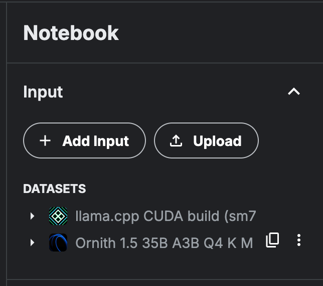
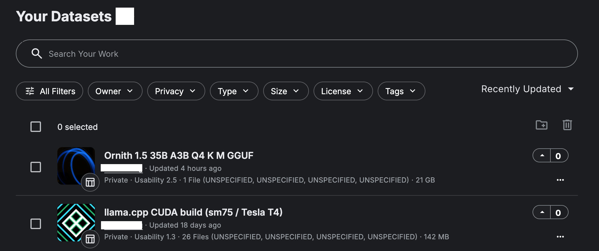

# Panduan Lengkap: Menjalankan Ornith-1.5-35B-A3B di Kaggle (Dual GPU T4)

Panduan ini berisi instruksi lengkap untuk menjalankan model **Ornith-1.5-35B-A3B** (format GGUF, kuantisasi Q4_K_M) di platform Kaggle menggunakan akselerator **2× GPU NVIDIA Tesla T4**. Eksekusi menggunakan `llama.cpp` (kompilasi mandiri dengan dukungan CUDA/sm75) yang diekspos ke internet melalui **Cloudflare Tunnel** serta dilindungi oleh otentikasi kunci API.

Seluruh alur kerja dibagi menjadi **tiga *notebook* terpisah**. Pemisahan ini bertujuan agar proses yang membutuhkan waktu lama dan memori besar (kompilasi dan pengunduhan model) cukup dilakukan **satu kali**, sehingga *notebook* deployment dapat dijalankan ulang secara cepat kapan saja server dibutuhkan.

```
┌─────────────────────────────┐     ┌──────────────────────────────┐     ┌───────────────────────────────────┐
│ 1. llama-dataset.ipynb       │     │ 2. ornith_dataset_builder.ipynb│    │ 3. ornith_kaggle_cloudflare.ipynb  │
│    Kompilasi llama.cpp (CUDA)│     │    Unduh model GGUF          │    │    Jalankan llama-server          │
│    -> Dataset Kaggle         │     │    -> Dataset Kaggle         │    │    + Cloudflare Tunnel + Kunci API │
│    (Cukup sekali / saat update)    │    (Cukup sekali / per quant)     │    (Dijalankan tiap butuh server)  │
└─────────────────────────────┘     └──────────────────────────────┘     └───────────────────────────────────┘
              │                                    │                                     │
              └───────────────► Tambah Data ◄──────┘                                     │
                                        │                                                 │
                                        └──────────────► Hubungkan ke Notebook 3 ◄────────┘
```

---

## Daftar Isi

1. [Prasyarat](#1-prasyarat)
2. [Tahap 1 — Kompilasi `llama.cpp` (CUDA) Menjadi Dataset](#2-tahap-1--kompilasi-llamacpp-cuda-menjadi-dataset)
3. [Tahap 2 — Mengunduh Model Ornith Menjadi Dataset](#3-tahap-2--mengunduh-model-ornith-menjadi-dataset)
4. [Tahap 3 — Menjalankan Server + Cloudflare Tunnel](#4-tahap-3--menjalankan-server--cloudflare-tunnel)
5. [Pengujian Endpoint (curl)](#5-pengujian-endpoint-curl)
6. [Opsional — Multi-model Gateway dengan 9Router](#6-opsional--multi-model-gateway-dengan-9router)
7. [Penanganan Masalah (Troubleshooting)](#7-penanganan-masalah-troubleshooting)
8. [Referensi Cepat Konfigurasi](#8-referensi-cepat-konfigurasi)

---

## 1. Prasyarat

- **Akun Kaggle** yang telah terverifikasi nomor telepon (wajib untuk mengakses GPU dan koneksi internet pada *notebook*).
- **Kuota GPU Kaggle** (tersedia sekitar 30 jam/minggu untuk akun terverifikasi).
- **Kaggle API Token** (`kaggle.json`) — diperoleh melalui menu `kaggle.com` → *Settings* → *API* → **Create New Token**.
- *(Opsional, untuk Named Tunnel)* **Akun Cloudflare** dengan domain yang sudah aktif.

**Kaggle Secrets yang Perlu Disiapkan** (*Add-ons* → *Secrets* pada setiap *notebook* yang relevan):

| Nama Secret | Digunakan Pada | Sifat | Deskripsi Isi |
|---|---|---|---|
| `kaggle_json` | Notebook 2 | Wajib (jika menggunakan unggah otomatis) | Seluruh teks file `kaggle.json` |
| `KAGGLE_USERNAME` | Notebook 1 | Opsional (unggah otomatis) | Nama pengguna Kaggle Anda |
| `KAGGLE_KEY` | Notebook 1 | Opsional (unggah otomatis) | Kunci API dari `kaggle.json` |
| `llama_server_api_key` | Notebook 3 | Sangat Disarankan | String bebas, contoh: `sk-ornith-rahasia123` |
| `cf_tunnel_token` | Notebook 3 | Opsional (Named Tunnel) | Token dari perintah `cloudflared tunnel token <nama>` |

> 💡 **Catatan:** Jika *secret* tidak diatur, *notebook* tetap dapat berjalan dengan mekanisme pencadangan otomatis (kunci API acak per sesi atau *quick tunnel* gratis). Namun, nilainya akan **berubah setiap kali sesi dijalankan ulang**. Untuk penggunaan rutin, disarankan untuk mengisi semua *secret* di atas agar URL dan kunci API tetap konsisten.

---

## 2. Tahap 1 — Kompilasi `llama.cpp` (CUDA) Menjadi Dataset

**File:** `llama-dataset.ipynb`  
**Frekuensi Eksekusi:** Cukup sekali, atau setiap kali ingin memperbarui versi `llama.cpp`.

### Langkah-langkah

1. Buka *notebook*, atur **Settings → Accelerator → GPU T4 x2**, lalu aktifkan **Internet → On**.
2. Jalankan sel secara berurutan:
   - **Periksa Versi CUDA** (`nvcc --version`, `nvidia-smi`) — pastikan terdeteksi 2× Tesla T4 dengan `compute_cap 7.5`.
   - **Kloning & Patch `llama.cpp`** — mengkloning repositori resmi, lalu menyisipkan *patch* ringan pada `ggml-cuda/CMakeLists.txt` agar target `CUDA::cuda_driver` mengarah ke `/usr/local/nvidia/lib64/libcuda.so` (dibutuhkan pada lingkungan Kaggle tertentu).
   - **Kompilasi** — jalankan perintah `cmake -DGGML_CUDA=ON -DCMAKE_CUDA_ARCHITECTURES=75 -DLLAMA_CURL=OFF`. Kode `sm75` mewakili arsitektur Turing (Tesla T4). Proses ini membutuhkan waktu 10–20 menit.
   - **Kumpulkan Hasil Kompilasi** — menyalin `llama-server`, `llama-cli`, dan seluruh berkas `.so` (`libggml*.so`, `libllama*.so`, dll.) ke dalam satu direktori tunggal `/kaggle/working/llama-cpp-cuda-sm75-build`. Langkah ini membuat biner dapat dieksekusi tanpa perlu mengatur `LD_LIBRARY_PATH` tambahan.
   - **Uji Fungsi (Smoke Test)** — jalankan `llama-server --version` untuk memastikan biner dapat berjalan tanpa kendala *linking*.
3. **Buat Dataset dari Hasil Kompilasi** melalui salah satu dari dua metode:
   - **Manual (Disarankan):** Pilih *Save Version* (centang *Save & Run All*) → buka tab **Output** → pilih **New Dataset** → beri nama, misalnya `llama-cpp-cuda-sm75-build`.
   - **Otomatis:** Isi Kaggle Secret `KAGGLE_USERNAME` & `KAGGLE_KEY`, lalu jalankan sel terakhir yang mengeksekusi perintah `kaggle datasets create` melalui API Kaggle.

### Kapan Harus Melakukan Kompilasi Ulang?

- Saat Anda membutuhkan fitur atau dukungan arsitektur model baru yang ada pada versi `llama.cpp` terbaru.
- Saat gambar (*image*) CUDA di Kaggle mengalami pembaruan versi utama (*major version*).
- Jika alokasi GPU Kaggle berubah (**bukan T4** atau *compute capability* ≠ 7.5), biner harus dikompilasi ulang sesuai nilai `CMAKE_CUDA_ARCHITECTURES` yang tepat.

Di luar kondisi tersebut, dataset biner ini **dapat digunakan kembali secara terus-menerus**.

---

## 3. Tahap 2 — Mengunduh Model Ornith Menjadi Dataset

**File:** `ornith_dataset_builder.ipynb`  
**Frekuensi Eksekusi:** Cukup sekali, atau ketika Anda ingin mengganti tingkat kuantisasi (*quant*) model.

### Langkah-langkah

1. **Pasang Alat Pendukung** — `huggingface_hub`, `kaggle`.
2. **Periksa Sisa Ruang Penyimpanan** (`df -h /kaggle/working /kaggle/temp`) — pastikan kapasitas media simpan mencukupi sebelum mengunduh.
3. **Unduh Berkas GGUF dari Hugging Face** ke direktori `/kaggle/temp/ornith-gguf`. 

   > 💡 Gunakan `/kaggle/temp`, bukan `/kaggle/working`. `/kaggle/temp` adalah direktori sementara (*scratch disk*) dengan kapasitas lebih besar dan **tidak memotong** batasan kuota *output* 20 GB milik `/kaggle/working`.

   ```python
   REPO_ID = "ornith-ai/Ornith-1.5-35B-A3B-GGUF"
   FILENAME = "Ornith-1.5-35B-Q4_K_M.gguf"   # Sesuaikan dengan kebutuhan
   ```

   > 🔗 **Model:** [Ornith-1.5-35B-A3B](https://huggingface.co/ornith-ai/Ornith-1.5-35B-A3B) — halaman resmi model di Hugging Face.

   | Kuantisasi | Ukuran Berkas | Kesesuaian untuk 2× T4 16GB (Total 32GB) |
   |---|---|---|
   | BF16 | 71.1 GB | ❌ Tidak Muat |
   | Q8_0 | 37.8 GB | ❌ Riskan (Terlalu Pas) |
   | Q6_K | 29.2 GB | ⚠️ Sangat Terbatas |
   | Q5_K_M | 25.3 GB | ✅ Bisa Digunakan |
   | **Q4_K_M** | **21.7 GB** | ✅ **Sangat Direkomendasikan** — memberikan ruang VRAM yang optimal untuk *KV cache* |

4. **Konfigurasi Kredensial Kaggle** — menggunakan data dari Kaggle Secret `kaggle_json`. Pastikan opsi *Secret* telah diaktifkan (**ON**) pada *notebook* ini.
5. **Buat Berkas `dataset-metadata.json`** — nilai `owner` diisi secara **otomatis** dari berkas `kaggle.json` yang dibaca untuk mencegah kesalahan *`Invalid Owner Id`*.
6. **Unggah ke Kaggle Datasets**:
   ```bash
   kaggle datasets create -p /kaggle/temp/ornith-gguf --dir-mode zip
   ```
   *(Jika dataset dengan id/slug yang sama sudah ada, gunakan perintah `kaggle datasets version`)*.

Setelah berhasil, dataset akan tersedia pada URL:  
`https://www.kaggle.com/datasets/<username-anda>/ornith-1-5-35b-a3b-q4km-gguf`

---

## 4. Tahap 3 — Menjalankan Server + Cloudflare Tunnel

**File:** `ornith_kaggle_cloudflare.ipynb`  
**Frekuensi Eksekusi:** Dijalankan setiap kali Anda membutuhkan server model yang aktif.

### Persiapan Sebelum Eksekusi

1. Pastikan **Accelerator → GPU T4 x2** dan **Internet → On**.
2. **Tambahkan Data (Add Data)** — hubungkan dua dataset yang telah dibuat pada Tahap 1 & 2:
   - `llama-cpp-cuda-sm75-build`
   - `ornith-1-5-35b-a3b-q4km-gguf` (atau nama dataset model Anda)
3. *(Sangat Direkomendasikan)* Atur Kaggle Secret `llama_server_api_key` agar kunci API tidak berubah setiap kali sesi dijalankan ulang.
4. *(Opsional)* Atur Kaggle Secret `cf_tunnel_token` untuk menggunakan URL tetap (lihat bagian [Named Tunnel](#named-tunnel-url-tetap)).

### Ilustrasi Alur Dataset

Berikut ilustrasi yang menggambarkan alur pembuatan dan penggunaan dataset pada *notebook* ini:


*`dataset.png` — Gambar dataset yang diinput sebelum menjalankan notebook 3.*


*`add-dataset.png` — Dataset yang berhasil dibuat untuk verifikasi.*

### Alur Kerja Sel (*Cell*)

| Sel | Fungsi Utama |
|---|---|
| **B0** | Membersihkan sisa penyimpanan sesi sebelumnya (`/kaggle/working/llama.cpp`, `llama-cpp-bin`, `ornith-gguf`). Jalankan sel ini jika menemui kendala *"No space left on device"*. |
| **B1** | Mendeteksi `llama-server` pada dataset terhubung, menyalin biner beserta berkas `.so` ke `/kaggle/working/llama-cpp-bin`, lalu mengonfigurasi `LD_LIBRARY_PATH`. |
| **B2** | Mencari lokasi berkas `.gguf` pada dataset model → `MODEL_PATH`. |
| **B2b** | Menyiapkan `API_KEY` dari Kaggle Secret `llama_server_api_key` (atau membuat kunci acak jika *secret* kosong). |
| **B3** | Menjalankan `llama-server` di latar belakang (*background*) dengan parameter `-ngl 999`, `--tensor-split 1,1`, panjang konteks 32K, *KV cache* Q8_0, serta proteksi `--api-key`. |
| **B4** | Memeriksa status keaktifan server serta memantau potensi penghentian akibat kehabisan memori (*Out of Memory* / OOM). |
| **C1** | Mengunduh dan memasang `cloudflared`. |
| **C4** | Membuka jaringan tunnel: memprioritaskan **Named Tunnel** (jika `cf_tunnel_token` ada), atau beralih otomatis ke **Quick Tunnel gratis** (`trycloudflare.com`). |
| **C5** | Menampilkan `PUBLIC_URL` dan `API_KEY` aktif, serta melakukan uji koneksi dasar. |
| **C6** | Menyediakan contoh perintah `curl` siap pakai (pengujian status, *chat completion*, *streaming*, dan pengujian otentikasi). |

### Jendela Konteks (*Context Window*)

Model Ornith-1.5-35B-A3B mendukung panjang konteks bawaan hingga **262.144 token (262K)**, yang dapat diperluas menggunakan mekanisme YaRN hingga ~1 juta token. Namun, pada GPU Kaggle Dual T4 (total VRAM 32 GB), kapasitas konteks dibatasi oleh sisa VRAM setelah bobot model dimuat (~21.7 GB untuk versi Q4_K_M).

```python
CONTEXT_LENGTH = 131072   # Pengaturan standar pada notebook
```

- *KV cache* dikuantisasi ke **Q8_0** (`--cache-type-k q8_0 --cache-type-v q8_0`, membutuhkan `--flash-attn on`) guna menghemat alokasi VRAM.
- **Jika mengalami OOM:** Turunkan nilai konteks ke `32768`, `16384` atau `8192`.
- **Jika VRAM masih mencukupi:** Nilai konteks dapat dinaikkan ke `65536` atau `131072`.

### Named Tunnel (URL Tetap)

Jika Anda memerlukan alamat URL publik yang **konstan** (tidak berubah setiap kali sesi restart), buatlah *tunnel* terlebih dahulu dari **komputer lokal** Anda:

```bash
cloudflared tunnel login
cloudflared tunnel create ornith-llm
cloudflared tunnel route dns ornith-llm llm.domainanda.com
cloudflared tunnel token ornith-llm
```

Simpan nilai token yang dihasilkan ke dalam Kaggle Secret dengan nama `cf_tunnel_token`. Sel C4 pada *notebook* 3 secara otomatis akan menggunakannya tanpa perlu proses autentikasi ulang.

Jika *token* tidak diisi, sistem akan menggunakan **Quick Tunnel gratis** (`https://xxxxx.trycloudflare.com`). Fitur ini ideal untuk pengujian sementara, tetapi URL akan berganti setiap kali sesi diaktifkan kembali.

---

## 5. Pengujian Endpoint (curl)

Jalankan sel **C6** pada *notebook* 3 untuk melihat daftar perintah pengujian yang disesuaikan dengan `URL` dan `API_KEY` yang sedang aktif.

```bash
# Pengujian status server (Health check)
curl -s https://<PUBLIC_URL>/health   -H "Authorization: Bearer <API_KEY>"

# Pengujian Chat Completion
curl -s https://<PUBLIC_URL>/v1/chat/completions   -H "Authorization: Bearer <API_KEY>"   -H "Content-Type: application/json"   -d '{
    "model": "Ornith-1.5-35B-Q4_K_M.gguf",
    "messages": [{"role": "user", "content": "Tuliskan fungsi Python untuk memeriksa bilangan prima."}],
    "max_tokens": 512,
    "temperature": 0.6
  }'

# Pengujian Chat Completion (Streaming)
curl -N -s https://<PUBLIC_URL>/v1/chat/completions   -H "Authorization: Bearer <API_KEY>"   -H "Content-Type: application/json"   -d '{"model": "Ornith-1.5-35B-Q4_K_M.gguf", "messages": [{"role":"user","content":"Halo"}], "stream": true}'

# Pengujian Tanpa Kunci API (Seharusnya mengembalikan respons HTTP 401)
curl -i https://<PUBLIC_URL>/health
```

Jalankan perintah di atas melalui **terminal lokal** Anda untuk memastikan endpoint dapat diakses secara publik dari luar lingkungan Kaggle.

---

## 6. Opsional — Multi-model Gateway dengan 9Router

Jika Anda berencana menggunakan **beberapa model sekaligus** (misalnya Ornith untuk instruksi umum dan model lain untuk tugas pemrograman, atau mengintegrasikan server Kaggle dengan penyedia cloud seperti Claude/GPT/Gemini), Anda dapat menggunakan **[9Router](https://github.com/decolua/9router)** sebagai *gateway* terpusat.

9Router adalah *gateway API* open-source lokal yang kompatibel dengan format OpenAI. Fitur ini memungkinkan integrasi berbagai aplikasi (seperti Claude Code, Cursor, Cline, dan Codex) ke berbagai penyedia model AI melalui satu *endpoint*, lengkap dengan fitur pemindahan otomatis (*auto-fallback*), kompresi token, dan penerjemahan format API.

### Manfaat Integrasi

- Interface `llama-server` pada Ornith sudah kompatibel dengan format OpenAI (`/v1/chat/completions`), sehingga dapat langsung **didaftarkan sebagai penyedia (*provider*)** di 9Router.
- Apabila server Kaggle terhenti (akibat batas waktu sesi, memori penuh, atau OOM), 9Router secara otomatis akan **mengalihkan permintaan** ke penyedia cadangan tanpa perlu mengubah konfigurasi pada aplikasi klien Anda.
- Anda memiliki **satu endpoint lokal tetap** (`http://localhost:20128/v1`) yang dapat dihubungkan ke seluruh perangkat kerja Anda.

### Panduan Instalasi Singkat (di Perangkat Lokal)

```bash
git clone https://github.com/decolua/9router.git
cd 9router
npm install
npm run build

export JWT_SECRET="buat-kunci-rahasia-aman-di-sini"
export INITIAL_PASSWORD="kata-sandi-anda"
export DATA_DIR="/var/lib/9router"
export PORT="20128"
export HOSTNAME="0.0.0.0"
export NODE_ENV="production"
```

Setelah layanan 9Router aktif, buka panel kontrol (*dashboard*) dan tambahkan penyedia baru dengan parameter:
- **Base URL:** `https://<PUBLIC_URL_dari_tunnel_anda>/v1`
- **API Key:** `<API_KEY>` (diperoleh dari sel B2b/C5 pada notebook 3)

> ⚠️ **Catatan:** Mengingat sesi GPU Kaggle tidak beroperasi 24/7, skenario penggunaan terbaik adalah memanfaatkan Ornith melalui 9Router selama jam kerja aktif, dan mengandalkan fitur *auto-fallback* 9Router saat server Kaggle dalam kondisi tidak aktif.

---

## 7. Penanganan Masalah (Troubleshooting)

| Masalah | Penyebab Utama | Solusi |
|---|---|---|
| Perikatan *"No space left on device"* saat pengunduhan/penyalinan berkas | Kuota penyimpanan `/kaggle/working` terbatas (~20 GB), atau terdapat sisa berkas dari proses sebelumnya. | Jalankan sel **B0** (pembersihan), pastikan model diunduh ke lokasi `/kaggle/temp`, atau lakukan **Restart Session** pada Kaggle. |
| Pesan kesalahan `Invalid Owner Id` saat eksekusi `kaggle datasets create` | Nilai `id` pada `dataset-metadata.json` tidak sesuai dengan nama pengguna Kaggle Anda. | Pastikan sel pembuatan metadata membaca nama pengguna secara **otomatis** dari `kaggle.json` yang dimuat. |
| Pesan kesalahan `No user secrets exist...` | Data *Secret* sudah dibuat pada akun, tetapi belum dihubungkan (*attached*) ke sesi *notebook*. | Masuk ke menu **Add-ons → Secrets**, pastikan tombol sakelar dalam kondisi **ON** untuk *notebook* yang sedang digunakan, lalu jalankan ulang sel. |
| Otentikasi ditolak (`Invalid API key`) pada aplikasi klien | Kunci API berubah setiap kali sesi diaktifkan (karena tidak diatur via *Secret*), atau kata `Bearer` ikut tersalin ke dalam kolom teks. | Atur Kaggle Secret `llama_server_api_key` agar nilainya konsisten. Masukkan hanya kode string kunci tanpa menyertakan awalan `Bearer`. |
| Kesalahan `NameResolutionError` / Domain tidak ditemukan | URL *Quick Tunnel* lama sudah tidak aktif (Quick Tunnel menghasilkan URL baru setiap eksekusi). | Gunakan selalu `PUBLIC_URL` terbaru yang ditampilkan pada *output* **sel C5**. |
| Server berhenti secara tiba-tiba setelah menaikkan parameter `-c` | Terjadi kehabisan memori (OOM) karena nilai `CONTEXT_LENGTH` melebihi kapasitas VRAM yang tersedia. | Turunkan nilai `CONTEXT_LENGTH` pada **sel B3** (rincian dapat dilihat pada tabel [Jendela Konteks](#jendela-konteks-context-window)). |
| Pesan kesalahan `error while loading shared libraries` saat menjalankan `llama-server` | Berkas pustaka pendukung (`.so`) tidak terdeteksi oleh sistem pada `LD_LIBRARY_PATH`. | Pastikan sel B1 berhasil mengonfigurasi `LD_LIBRARY_PATH` ke direktori penyimpan berkas biner dan pustaka `.so`. |

---

## 8. Referensi Cepat Konfigurasi

```python
# Pengaturan Model
REPO_ID  = "ornith-ai/Ornith-1.5-35B-A3B-GGUF"
FILENAME = "Ornith-1.5-35B-Q4_K_M.gguf"     # Ukuran berkas: ~21.7 GB

# Parameter llama-server (Kaggle Dual T4)
-ngl 999                  # Mengalihkan (offload) seluruh layer ke GPU
--tensor-split 1,1        # Membagi beban kerja secara seimbang ke kedua GPU
-c 32768                  # Ukuran jendela konteks (sesuaikan dengan sisa VRAM)
--flash-attn on
--cache-type-k q8_0       # Kuantisasi KV cache untuk efisiensi penggunaan VRAM
--cache-type-v q8_0
--api-key <API_KEY>       # Mewajibkan header otentikasi: Authorization: Bearer <API_KEY>

# Perintah Kompilasi llama.cpp
cmake -B build -DGGML_CUDA=ON -DCMAKE_CUDA_ARCHITECTURES=75 -DLLAMA_CURL=OFF
```

**Ringkasan Spesifikasi Model Ornith-1.5-35B-A3B:**
- Total 35,8 Miliar parameter (~3,1 Miliar parameter aktif per token melalui arsitektur 8 *active experts* + *shared expert* dari total 256 *experts*).
- 40 layer *hybrid attention* (kombinasi *DeltaNet linear attention* dan *full attention*).
- Panjang konteks bawaan (*native*) sebesar 262.144 token (dapat ditingkatkan hingga ~1M token menggunakan skema YaRN).
- Multimodal (*vision tower*) serta mendukung kemampuan penalaran (*reasoning*) dengan blok `<think>` secara bawaan.
- Dilisensikan di bawah lisensi terbuka **MIT**.
