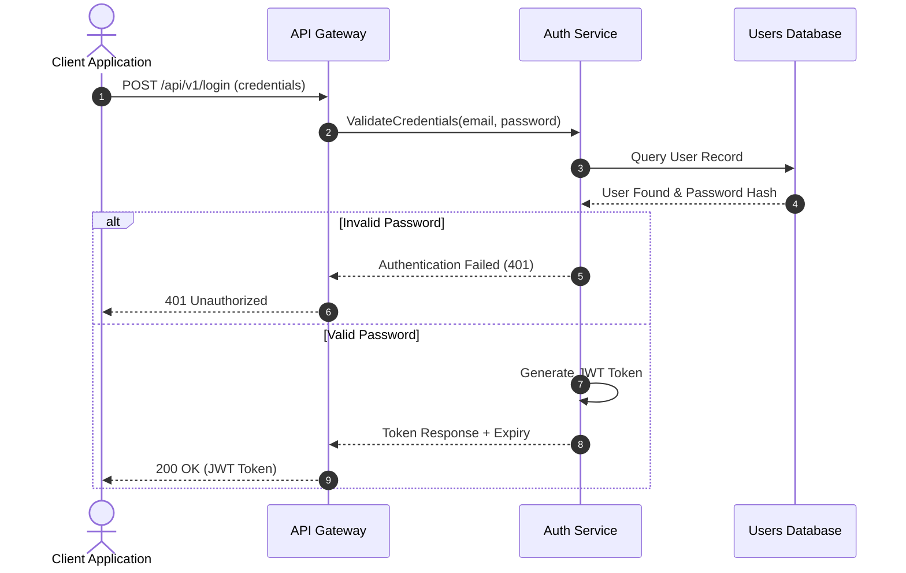

# Design & Structured Media Skill: PDF Processing, Image Manipulation, and Diagramming

## 1. Quick Decision Matrix

Determine the media processing approach based on input format and desired deliverable:

| Task / Domain | Recommended Tool / Library | Key Strategy & Approach |
|---|---|---|
| **PDF Text & Table Extraction** | `pdfplumber` | Extract structured text preserving layout; parse complex tables to DataFrame/JSON. |
| **PDF Page Manipulation** | `pypdf` / `pdf2image` | Merge, split, rotate, or reorder pages without rasterizing vector text. |
| **Image Processing & Editing** | `Pillow` (Python) / `sharp` (JS) | Perform aspect-ratio aware resizing, format conversion, and watermark/cropping. |
| **Optical Character Recognition** | `pytesseract` / `easyocr` | Preprocess image (grayscale, threshold) before executing OCR on scanned images/PDFs. |
| **Diagramming & Architecture** | Mermaid (`mermaid.js`) | Generate text-based flowcharts, sequence diagrams, state machines, and ERDs. |

---

## 2. Standard Execution Workflows

### Workflow A: PDF Extraction & Table Parsing (`pdfplumber`)


```

[Inspect PDF Structure] ──> [Detect Scanned vs Native Vector] ──> [Extract Text/Tables] ──> [Format Output]

```

1. **PDF Type Detection**:
   * Test if the PDF contains native text layers (`pdf.pages[0].extract_text()`).
   * If text is empty or non-selectable, route to OCR workflow via `pdf2image` + `pytesseract`.
2. **Table Extraction**:
   * Use `pdfplumber` explicit extraction settings (`vertical_strategy`, `horizontal_strategy`) to isolate cell boundaries cleanly.
3. **Data Cleaning**:
   * Strip trailing whitespace, remove header/footer repetition, and handle merged cells.

### Workflow B: Mermaid Diagram Generation


```

[Analyze Flow/System Architecture] ──> [Choose Diagram Type] ──> [Structure Nodes & Links] ──> [Validate Syntax]

```

1. **Type Selection**:
   * **Flowchart** (`flowchart TD` / `LR`): Processes, decisions, pipelines.
   * **Sequence Diagram** (`sequenceDiagram`): API calls, microservice communication, auth flows.
   * **ER Diagram** (`erDiagram`): Database schemas and entity relationships.
2. **Node Styling & Syntax Safety**:
   * Wrap node labels containing special characters or spaces in double quotes (`id["Text with (special) chars"]`).
   * Keep subgraph relationships clean and legible.

---

## 3. Essential Technical Standards & Footguns

### PDF Processing Traps
- [ ] **Scanned PDF Fallback**: Never assume a PDF contains selectable text. Always check string length and fall back to OCR if empty.
- [ ] **Memory Bloat on Large PDFs**: Process pages iteratively using generators or page loops (`for page in pdf.pages:`) instead of loading entire multi-hundred-page files into memory at once.
- [ ] **Coordinate Inversion**: Remember that PDF coordinate origins (`0,0`) are typically at the **bottom-left**, whereas standard image libraries place `0,0` at the **top-left**.

### Image Manipulation Footguns
- [ ] **Aspect Ratio Distortion**: Never resize images with hardcoded width and height without maintaining aspect ratio unless explicitly requested. Use `image.thumbnail((max_w, max_h))` or explicit scale factors.
- [ ] **JPEG Transparency Error**: Converting an `RGBA` image with transparency directly to `JPEG` causes runtime crashes in Pillow. Always convert `RGBA` to `RGB` with a solid background fill first.
- [ ] **EXIF Orientation Loss**: Always apply `ImageOps.exif_transpose(image)` upon opening an image to prevent auto-rotated photos from rendering sideways.

### Mermaid Diagram Footguns
- [ ] **Unescaped Special Characters**: Characters like `()`, `[]`, `{}`, and `"` inside node titles will break the Mermaid rendering parser. Always enclose labels in double quotes.
- [ ] **Overly Complex Single Diagrams**: Break huge systems into multiple sub-diagrams or subgraphs. A single diagram with >30 nodes creates illegible renders.
- [ ] **Inconsistent Arrow Syntax**: Double-check arrow directions and line styles (e.g., `-->` for solid, `-.->` for dotted, `==>` for thick).

---

## 4. Code & Specification Templates

### Boilerplate 1: Robust PDF Table Extraction (`pdfplumber`)

```python
import pdfplumber
import pandas as pd
from typing import List, Dict, Any

def extract_tables_from_pdf(pdf_path: str) -> List[pd.DataFrame]:
    extracted_tables = []
    
    with pdfplumber.open(pdf_path) as pdf:
        for page_num, page in enumerate(pdf.pages, start=1):
            # Extract explicit tables with custom line tolerance
            tables = page.extract_tables({
                "vertical_strategy": "lines",
                "horizontal_strategy": "lines",
                "snap_tolerance": 3,
            })
            
            for table in tables:
                if not table or len(table) < 2:
                    continue
                
                # Assume first row is header
                df = pd.DataFrame(table[1:], columns=table[0])
                # Clean up newlines inside cells
                df = df.applymap(lambda x: x.replace("\n", " ").strip() if isinstance(x, str) else x)
                extracted_tables.append(df)
                
    return extracted_tables

```

### Boilerplate 2: Microservice Authentication Flow (`sequenceDiagram`)



---

## 5. Verification & Quality Assurance Checklist

Before delivering media processing scripts or Mermaid diagrams, verify against these gates:

1. **PDF Text Extraction Quality**: Is the extracted text legible, without fragmented words or missing cell borders?
2. **Image Color & Orientation**: Does the converted/resized image maintain its original orientation (EXIF) and display correctly without transparency artifacts?
3. **Mermaid Parser Validity**: Is the generated Mermaid syntax valid and free of syntax-breaking special characters?
4. **Diagram Readability**: Is the graph direction (`TD` vs `LR`) logical, with clean node relationships and no overlapping link paths?

---

## 6. Dukungan Termux (Android) — garwa ringan & robust

Skill design-media berjalan di Termux. **Inti (PDF text/table extraction, merge/split, image processing) hanya butuh pustaka Python murni** (`pdfplumber`, `pypdf`, `Pillow`) — ringan. OCR (`pytesseract`) butuh `tesseract` (paket Termux, opsional). Mermaid cukup ditulis sebagai teks (render butuh tool eksternal, opsional).

> **Di desktop/VPS dengan resource cukup:** tetap install tool desktop penuh (bagian Dependensi) untuk hasil maksimal — `tesseract` untuk OCR, `poppler-utils`/`python-pymupdf` untuk render PDF, `imagemagick` untuk image processing CLI, dan renderer Mermaid (browser/Node) untuk diagram visual. Fallback di bawah HANYA untuk lingkungan terbatas/Termux.

```bash
# 0. PENTING — perbaiki pip dulu bila error "No module named 'pip._internal.operations.install.wheel'".
#    Itu BUKAN pip rusak permanen: akar masalahnya libexpat terlalu lama (2.7.x) yang tidak punya
#    simbol XML_SetHashSalt16Bytes yang dibutuhkan pyexpat Python 3.14. Upgrade libexpat:
pkg install -y libexpat        # upgrade ke 2.8.4 → pyexpat OK → pip install bekerja (TERUJI 2026-09)
# 1. Wajib — pustaka inti (pip; TERUJI berhasil diinstall & di-import)
pip3 install --break-system-packages pdfplumber pypdf Pillow
# 2. Opsional — OCR: tesseract TERSEDIA di repo Termux + pytesseract via pip
pkg install -y tesseract && pip3 install --break-system-packages pytesseract
# 3. Opsional — render PDF halaman jadi gambar: python-pymupdf (PyMuPDF/fitz) TERSEDIA sebagai paket Termux
pkg install -y python-pymupdf
# 4. Opsional — image resize/convert cepat via CLI: imagemagick (convert) TERSEDIA di repo Termux
pkg install -y imagemagick
```

**Fallback ringan:**
- **OCR** tanpa `tesseract`: untuk teks digital (bukan scan), `pdfplumber`/`pypdf` sudah cukup. Untuk scan, `easyocr` (pip, murni Python tapi berat — butuh torch) atau beri tahu user bahwa OCR butuh `tesseract` (paket Termux).
- **Render PDF → gambar** tanpa `poppler-utils`: pakai `python-pymupdf` (paket Termux, `fitz`) — lebih ringan & tanpa poppler.
- **Mermaid render**: Mermaid biasanya di-render di browser/Node. Di Termux, cukup tulis sintaks Mermaid yang valid sebagai teks; render visual bisa dilakukan nanti di desktop/browser.

> **Catatan pip di Termux (TERUJI):** `pdfplumber`, `pypdf`, `Pillow` adalah wheel murni — `pip3 install --break-system-packages` berhasil SETELAH `libexpat` di-upgrade (lihat langkah 0). Kalau muncul error `install_wheel`, JANGAN asumsikan pip rusak — upgrade `libexpat` dulu. Gunakan `--break-system-packages` karena Termux memakai sistem Python.