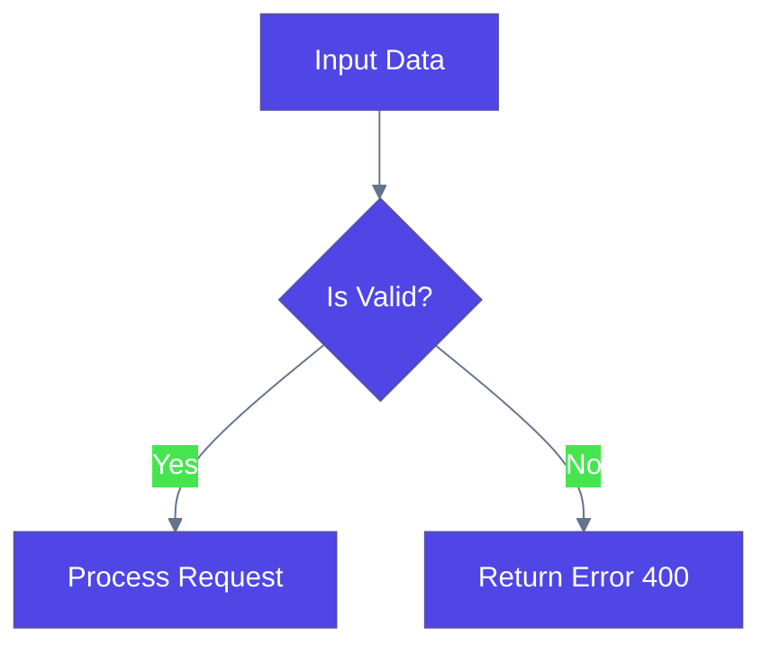
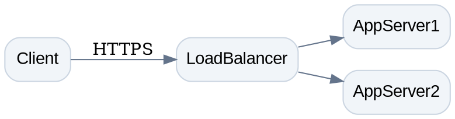
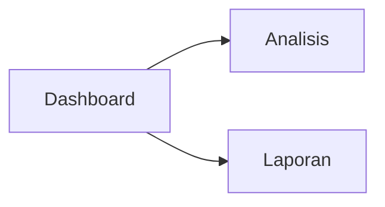

# SVG & Diagram Generation (Mermaid, Graphviz, Raw SVG)

## Tool Selection Matrix

| Diagram Type | Best Engine | Recommended Output Format |
|---|---|---|
| Flowcharts, Sequence, ERD, Class, Mindmaps | **Mermaid.js** | Mermaid Code Block (````mermaid ... ````) |
| System Architecture, Complex Graphs, Trees | **Graphviz (DOT)** | DOT Code / Rendered SVG |
| Custom UI Mockups, Custom Charts, Icons | **Raw SVG** | Clean `<svg>` Code Block |

---

## Core Requirements (Mandatory)

1. **Self-Contained & Valid Syntax:**
   - Always ensure code blocks are syntactically complete without unescaped characters or broken syntax tags.
   - For Raw SVG, include valid `xmlns="http://www.w3.org/2000/svg"`, `viewBox`, `width`, and `height` attributes.

2. **Visual Hierarchy & Styling:**
   - **Colors:** Use a modern, cohesive palette (e.g., Slate/Indigo or Dark Mode dark backgrounds with pastel accents). Avoid default saturated primary colors (pure red `#FF0000`, pure green `#00FF00`).
   - **Readability:** Ensure sufficient text-to-background contrast (WCAG AAA compliant).
   - **Responsiveness:** Raw SVG components must use `viewBox` for proportional scaling.

3. **Performance & Cleanliness:**
   - No inline CSS clutter where reusable classes can be used.
   - Keep vector paths optimized and concise.

---

## Engine Guidelines

### 1. Mermaid.js Guidelines
Use standard Mermaid syntax inside a ````mermaid```` code block.

- **Theme Customization:** Use `%%init%%` directives for styling consistency.
- **Node Escaping:** Enclose node labels containing special characters or spaces in double quotes: `nodeA["Process (Step 1)"]`.



---

### 2. Graphviz / DOT Guidelines

Use for structural graphs, hierarchical trees, and complex network topographies.

* **Attributes:** Always set `rankdir` (LR or TB), `splines=ortho` or `curved`, and node shapes explicitly.



---

### 3. Raw SVG Guidelines

Use when full artistic control, specific custom charts (donut, scatter, sparklines), or UI component mockups are needed.

* **Structure:** Enclose strictly within a `<svg>` root tag.
* **Accessibility:** Add `<title>` and `<desc>` inside the `<svg>` tag.
* **Layout Rule:** Define `viewBox="0 0 W H"` to allow dynamic scaling.

```xml
<svg xmlns="[http://www.w3.org/2000/svg](http://www.w3.org/2000/svg)" viewBox="0 0 400 180" width="100%" height="100%">
  <title>Minimal Donut Chart</title>
  <rect width="100%" height="100%" fill="#0F172A" rx="8"/>
  
  <!-- Donut Segment 1 -->
  <circle cx="90" cy="90" r="50" fill="transparent" stroke="#6366F1" stroke-width="20" stroke-dasharray="220 314" />
  <!-- Donut Segment 2 -->
  <circle cx="90" cy="90" r="50" fill="transparent" stroke="#10B981" stroke-dasharray="94 314" stroke-dashoffset="-220" stroke-width="20" />
  
  <!-- Legend -->
  <text x="170" y="80" fill="#F8FAFC" font-family="sans-serif" font-size="14" font-weight="bold">Segment A (70%)</text>
  <text x="170" y="110" fill="#F8FAFC" font-family="sans-serif" font-size="14" font-weight="bold">Segment B (30%)</text>
</svg>

```

---

## Technical Gotchas & Avoidance Rules

1. **Mermaid Subgraph IDs:** Subgraph IDs cannot contain spaces or special characters (e.g., use `subgraph sg_backend [Backend Services]`, NOT `subgraph Backend Services`).
2. **Text Overlap in SVG:** Always calculate horizontal/vertical offsets (`x`, `y`, `dx`, `dy`) carefully in Raw SVG to prevent text elements from colliding.
3. **External Dependencies:** Do NOT reference external custom fonts or external image assets (`<image href="http...">`) via remote URL inside Raw SVG, as they will fail in offline or sandboxed renderers. Use system fonts (Arial, Helvetica, sans-serif, system-ui).

---

## Interactive SVG (Tooltip, Hover, Animation)

When the user requests an **interactive** dashboard, chart, or diagram (tooltip on hover, hover highlight, or animation), use these patterns. Interactive SVG works best in browsers; keep it self-contained (no external JS libraries) so it renders in any modern browser and in offline/sandboxed previewers.

### 1. Tooltip via `<title>` (Simplest, Zero-JS)

Native SVG `<title>` shows a browser tooltip on hover. Add it inside any element.

```xml
<svg xmlns="http://www.w3.org/2000/svg" viewBox="0 0 400 200" width="100%">
  <title>Dashboard Penjualan</title>
  <rect x="20" y="20" width="120" height="60" rx="8" fill="#4F46E5">
    <title>Q1: Rp 120 jt (+12%)</title>
  </rect>
  <rect x="160" y="20" width="120" height="60" rx="8" fill="#10B981">
    <title>Q2: Rp 145 jt (+21%)</title>
  </rect>
</svg>
```

### 2. Hover Highlight via CSS `<style>`

Use embedded CSS with `:hover` to change fill/stroke/opacity on hover. This is pure SVG + CSS, no JS.

```xml
<svg xmlns="http://www.w3.org/2000/svg" viewBox="0 0 400 220" width="100%">
  <title>Bar Chart Interaktif</title>
  <style>
    .bar { fill: #6366F1; transition: fill 0.2s ease; cursor: pointer; }
    .bar:hover { fill: #F59E0B; }
    .bar:hover + .label { opacity: 1; }
    .label { opacity: 0; transition: opacity 0.2s ease; fill: #0F172A; font-family: sans-serif; font-size: 12px; }
  </style>
  <rect class="bar" x="30" y="120" width="60" height="80" rx="6"/>
  <text class="label" x="45" y="110">120</text>
  <rect class="bar" x="130" y="80" width="60" height="120" rx="6"/>
  <text class="label" x="145" y="70">180</text>
  <rect class="bar" x="230" y="40" width="60" height="160" rx="6"/>
  <text class="label" x="245" y="30">240</text>
</svg>
```

### 3. Animation via CSS Keyframes

Use CSS `@keyframes` for entrance animations (fade-in, grow, draw). Keep durations short (0.3–0.8s) and avoid infinite loops unless requested.

```xml
<svg xmlns="http://www.w3.org/2000/svg" viewBox="0 0 400 220" width="100%">
  <title>Donut Chart Animasi</title>
  <style>
    @keyframes grow { from { stroke-dashoffset: 314; } to { stroke-dashoffset: 0; } }
    .seg { fill: none; stroke-width: 24; animation: grow 0.8s ease-out forwards; }
  </style>
  <circle class="seg" cx="110" cy="110" r="50" stroke="#6366F1" stroke-dasharray="220 314"/>
  <circle class="seg" cx="110" cy="110" r="50" stroke="#10B981" stroke-dasharray="94 314" stroke-dashoffset="-220" style="animation-delay:0.2s"/>
</svg>
```

### 4. Interactive Mermaid (Clickable Nodes)

Mermaid supports `click` handlers for navigation. Use `click nodeId "url"` or `click nodeId callback`. For pure navigation (no JS), link to anchors/URLs.



### Rules for Interactive SVG

1. **Self-contained:** No external JS/CDN. Use native `<title>`, CSS `:hover`, and CSS `@keyframes` only.
2. **Accessibility:** Always include `<title>` and `<desc>`; ensure hover states also have a non-hover fallback (e.g., label visible on focus).
3. **Performance:** Limit animations to a few elements; avoid animating large groups.
4. **Fallback:** If the renderer strips `<style>` or `<title>`, the SVG must still be readable statically (don't rely solely on hover to convey critical data).
5. **State clarity:** For hover-highlight, also add `:focus` styles so keyboard users get the same feedback.